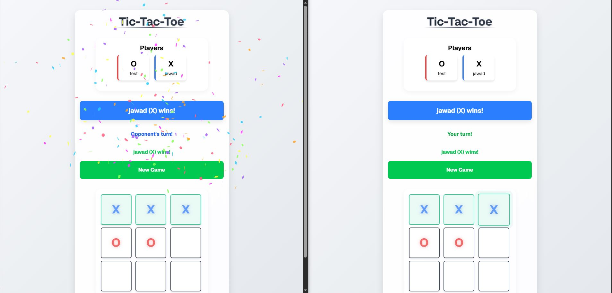

# Multiplayer Tic Tac Toe

A real-time multiplayer Tic Tac Toe game built with Socket.IO, Node.js, and JavaScript.



## Features

- Real-time multiplayer gameplay
- User-friendly interface with modern design
- Visual feedback for game actions
- Player connection status tracking
- Win detection with visual highlighting
- Victory animations and effects
- Responsive design for all devices
- Robust handling of disconnections and reconnections

## Technologies Used

- **Backend**: Node.js, Socket.IO
- **Frontend**: HTML5, CSS3, JavaScript
- **Styling**: Tailwind CSS
- **Animation**: Custom CSS animations
- **Effects**: Canvas Confetti

## How to Play

1. Open the application in your browser
2. Enter a username to join the game
3. Wait for another player to join or invite a friend
4. Players take turns marking spaces on the 3×3 grid
5. The first player to get 3 marks in a row (horizontally, vertically, or diagonally) wins
6. If all spaces are filled without a winner, the game is a draw

## Installation

### Prerequisites
- Node.js (v12.0.0 or higher)
- npm (v6.0.0 or higher)

### Setup
1. Clone the repository:
   ```bash
   git clone https://github.com/jawad-elhajjami/tic-tac-toe-socketio.git
   cd tic-tac-toe-socketio
   ```

2. Install dependencies:
   ```bash
   npm install
   ```

3. Start the server:
   ```bash
   node index.js
   ```

4. Open your browser and navigate to:
   ```
   [project_directory]/client/index.html
   ```

## Contributing

1. Fork the repository
2. Create a new branch (`git checkout -b feature/your-feature`)
3. Commit your changes (`git commit -m 'Add some feature'`)
4. Push to the branch (`git push origin feature/your-feature`)
5. Open a Pull Request

## License

This project is licensed under the MIT License - see the LICENSE file for details.
